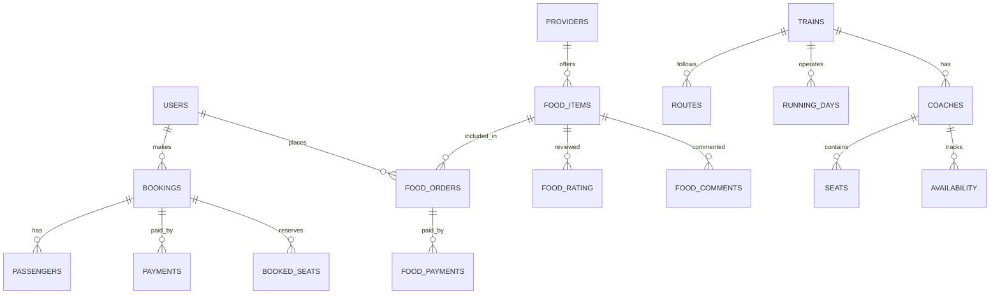

# 🚆 Dine Rail

**Dine Rail** is a web application built with **Next.js, Node.js, and SQL** that enables Indian Railway travelers to order food during their journey.  
It connects passengers with station vendors, offering more choices and a smooth ordering experience while traveling.  

---

## 📝 Description

- Passengers can order food from partnered station vendors.  
- Vendors can manage their menus and incoming orders.  
- Orders are delivered directly to passengers on the train or at stations.  
- Provides convenience, wider food options, and digital payments during travel.  

---

## 🛠️ Tech Stack

- **Frontend:** Next.js  
- **Backend:** Node.js (Express)  
- **Database:** SQL (MySQL/PostgreSQL)  
- **Environment Variables:** `.env` for database & server configs  

---

## ⚙️ Setup & Installation

### 1. Clone the repository
```bash
git clone https://github.com/your-username/dine-rail.git
cd dine-rail
````

### 2. Install dependencies

```bash
npm install
# or
yarn install
```

### 3. Configure Environment (`.env`)

Create a `.env` file in the project root:

```env
# Database
DB_HOST=localhost
DB_PORT=3306
DB_USER=root
DB_PASSWORD=yourpassword
DB_NAME=dinerail

# JWT / Session
JWT_SECRET=your_jwt_secret

# Server 
PORT=5000
NEXT_PUBLIC_API_URL=http://localhost:5000/api

# RapidApi key
NEXT_PUBLIC_RAPIDAPI_KEY=Yourrapidapikey
```

### 4. Database Setup

```sql
CREATE DATABASE dinerail;
```

👉 Full schema can be found here: [📂 Database Schema](#-database-schema)

### 5. Run the project

```bash
# Backend
cd backend
npm run dev
# or
npm start

# Frontend
cd frontend
npm run dev
```

👉 Frontend: `http://localhost:3000`
👉 Backend API: `http://localhost:5000`

---

## 📬 API Collection (Postman)

You can explore and test the API using the Postman collection:
[🔗 Postman Collection](https://nehayadav-9281583.postman.co/workspace/Neha-Yadav's-Workspace~07360df9-d2f0-4016-84e1-76d0b5046ea5/collection/44595837-0acf8aef-925c-4d73-a817-eb21be9d16aa?action=share&creator=44595837)

---
---

## Confluence Collection
You can explore some more of the collection databases and postman in my confluence space 
[🔗 confluence space](https://yadavneha0401-1746091905606.atlassian.net/wiki/x/wAEB)

---

## 🗄️ Database Schema

### 📊 ER Diagram (High-Level)



---

### 🛠️ Full SQL Schema

```sql
-- USERS TABLE
CREATE TABLE users (
    id VARCHAR(40) PRIMARY KEY,
    email VARCHAR(255) UNIQUE NOT NULL,
    user_img TEXT,
    name VARCHAR(100) NOT NULL,
    phone_no VARCHAR(15),
    dob DATE,
    aadhar_card VARCHAR(12) UNIQUE,
    password VARCHAR(255) NOT NULL,
    created_at TIMESTAMP DEFAULT CURRENT_TIMESTAMP
);

-- PROVIDERS TABLE
CREATE TABLE providers (
    id VARCHAR(40) PRIMARY KEY,
    email VARCHAR(255) UNIQUE NOT NULL,
    password VARCHAR(255) NOT NULL,
    name VARCHAR(100) NOT NULL,
    gst_number VARCHAR(15) NOT NULL,
    user_img TEXT,
    provider_type ENUM('TRAIN_SERVICE', 'STATION_VENDOR') NOT NULL,
    train_name VARCHAR(100),
    train_number VARCHAR(10),
    station_name VARCHAR(100),
    created_at TIMESTAMP DEFAULT CURRENT_TIMESTAMP,
    contact_number VARCHAR(20)
);

-- TRAINS & RELATED TABLES
CREATE TABLE trains (
  train_number VARCHAR(10) PRIMARY KEY,
  train_name VARCHAR(100),
  source_station VARCHAR(10),
  destination_station VARCHAR(10)
);

CREATE TABLE routes (
  train_number VARCHAR(10),
  station_code VARCHAR(10),
  arrival TIME,
  departure TIME,
  day INT,
  PRIMARY KEY (train_number, station_code, day),
  FOREIGN KEY (train_number) REFERENCES trains(train_number)
);

CREATE TABLE running_days (
  train_number VARCHAR(10),
  day_code VARCHAR(3),
  PRIMARY KEY (train_number, day_code),
  FOREIGN KEY (train_number) REFERENCES trains(train_number)
);

CREATE TABLE coaches (
  train_number VARCHAR(10),
  coach_id VARCHAR(10),
  coach_type VARCHAR(50),
  class VARCHAR(5),
  fare DECIMAL(10, 2),
  total_seats INT,
  PRIMARY KEY (train_number, coach_id),
  FOREIGN KEY (train_number) REFERENCES trains(train_number)
);

CREATE TABLE seats (
  train_number VARCHAR(10),
  coach_id VARCHAR(10),
  seat_number VARCHAR(5),
  berth VARCHAR(5),
  booked BOOLEAN,
  PRIMARY KEY (train_number, coach_id, seat_number),
  FOREIGN KEY (train_number, coach_id) REFERENCES coaches(train_number, coach_id)
);

CREATE TABLE availability (
  travel_date DATE,
  train_number VARCHAR(10),
  coach_id VARCHAR(10),
  available_seats INT,
  PRIMARY KEY (travel_date, train_number, coach_id),
  FOREIGN KEY (train_number, coach_id) REFERENCES coaches(train_number, coach_id)
);

CREATE TABLE booked_seats (
  travel_date DATE,
  train_number VARCHAR(10),
  coach_id VARCHAR(10),
  seat_number VARCHAR(5),
  PRIMARY KEY (travel_date, train_number, coach_id, seat_number),
  FOREIGN KEY (travel_date, train_number, coach_id) REFERENCES availability(travel_date, train_number, coach_id)
);

CREATE TABLE bookings (
  booking_id VARCHAR(20) PRIMARY KEY,
  train_number VARCHAR(10),
  travel_date DATE,
  coach_id VARCHAR(10),
  from_station VARCHAR(10),
  to_station VARCHAR(10),
  booking_status VARCHAR(20),
  fare DECIMAL(10, 2),
  payment_status VARCHAR(20),
  timestamp TIMESTAMP,
  FOREIGN KEY (train_number, coach_id) REFERENCES coaches(train_number, coach_id)
);

CREATE TABLE passengers (
  booking_id VARCHAR(20),
  name VARCHAR(100),
  age INT,
  gender CHAR(1),
  berth_preference VARCHAR(5),
  PRIMARY KEY (booking_id, name),
  FOREIGN KEY (booking_id) REFERENCES bookings(booking_id)
);

-- PAYMENTS TABLE
CREATE TABLE payments (
    id VARCHAR(40) PRIMARY KEY,
    payment_id VARCHAR(255),
    amount DECIMAL(10,2),
    booking_id VARCHAR(40),
    user_id VARCHAR(40),
    status ENUM('PENDING', 'SUCCESS', 'FAILED'),
    created_at TIMESTAMP DEFAULT CURRENT_TIMESTAMP,
    FOREIGN KEY (booking_id) REFERENCES bookings(booking_id) ON DELETE CASCADE,
    FOREIGN KEY (user_id) REFERENCES users(id) ON DELETE CASCADE
);

-- FOOD ITEMS
CREATE TABLE food_items (
    id VARCHAR(40) PRIMARY KEY,
    provider_id VARCHAR(40),
    provider_name VARCHAR(100),
    name VARCHAR(100),
    description TEXT,
    price DECIMAL(10,2),
    image_url TEXT,
    created_at TIMESTAMP DEFAULT CURRENT_TIMESTAMP,
    FOREIGN KEY (provider_id) REFERENCES providers(id)
);

-- FOOD ORDERS
CREATE TABLE food_orders (
    id VARCHAR(40) PRIMARY KEY,
    user_id VARCHAR(40),
    provider_id VARCHAR(40),
    food_item_id VARCHAR(40),
    booking_id VARCHAR(40),
    train_name VARCHAR(100),
    train_no VARCHAR(10),
    seat_number VARCHAR(10),
    quantity INT,
    total_price DECIMAL(10,2),
    order_type ENUM('TRAIN_SERVICE', 'STATION_VENDOR'),
    status ENUM('PLACED', 'DELIVERED', 'CANCELLED') DEFAULT 'PLACED',
    created_at TIMESTAMP DEFAULT CURRENT_TIMESTAMP,
    FOREIGN KEY (user_id) REFERENCES users(id),
    FOREIGN KEY (provider_id) REFERENCES providers(id),
    FOREIGN KEY (food_item_id) REFERENCES food_items(id),
    FOREIGN KEY (booking_id) REFERENCES bookings(booking_id)
);

-- FOOD RATING
CREATE TABLE food_rating(
    id VARCHAR(40) PRIMARY KEY,
    user_id VARCHAR(40),
    order_id VARCHAR(40),
    food_item_id VARCHAR(40),
    review INT CHECK (review BETWEEN 1 AND 5),
    comment VARCHAR(220),
    UNIQUE (user_id, food_item_id),
    FOREIGN KEY (user_id) REFERENCES users(id),
    FOREIGN KEY (food_item_id) REFERENCES food_items(id),
    FOREIGN KEY (order_id) REFERENCES food_orders(id)
);

-- FOOD COMMENTS
CREATE TABLE food_comments (
    id VARCHAR(40) PRIMARY KEY,
    user_id VARCHAR(40),
    food_item_id VARCHAR(40),
    comment_text TEXT,
    created_at TIMESTAMP DEFAULT CURRENT_TIMESTAMP,
    FOREIGN KEY (user_id) REFERENCES users(id),
    FOREIGN KEY (food_item_id) REFERENCES food_items(id)
);

-- FOOD PAYMENTS
CREATE TABLE food_payments (
    id VARCHAR(40) PRIMARY KEY,
    order_id VARCHAR(40),
    user_id VARCHAR(40),
    food_item_id VARCHAR(40),
    food_name VARCHAR(100),
    payment_amount DECIMAL(10,2),
    payment_status ENUM('PENDING', 'SUCCESS', 'FAILED'),
    payment_method VARCHAR(50),
    paid_at TIMESTAMP DEFAULT CURRENT_TIMESTAMP,
    FOREIGN KEY (order_id) REFERENCES food_orders(id),
    FOREIGN KEY (user_id) REFERENCES users(id),
    FOREIGN KEY (food_item_id) REFERENCES food_items(id)
);
```

---
